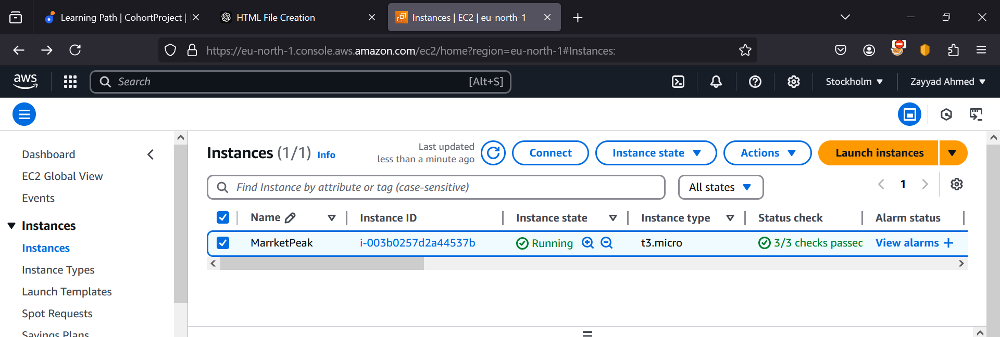

### 1. Capstone Project: Ecommerce Platform Deployment with Git, LInux and AWS

1. **Initialize a Git Repository**  
   I created a Git repository called `MarketPeak_Ecommerce` for the project.

2. **Prepared the eCommerce Website**  
   I obtained and prepared the eCommerce website template from [Tooplate](https://www.tooplate.com/) and downloaded it to my local system.  
     

3. **Stage and Commit the Template**  
   I staged and committed the template files to the Git repository:
   - `git add .`
   - `git commit -m "Initial commit with eCommerce template"`

4. **Push the Code to GitHub**  
   I pushed the local changes to the GitHub repository:
   - `git push origin master`

---

### 2. Set up an AWS EC2 Instance

1. **Launch Amazon Linux EC2 Instance**  
   I launched an Amazon Linux EC2 instance on AWS to deploy the website.  
   

2. **Clone the Repository on the EC2 Server**  
   I cloned the `MarketPeak_Ecommerce` repository to the EC2 instance:
   - `git clone https://github.com/azayyad48/MarketPeak_Ecommerce.git`

3. **Set up SSH Key Pair**  
   I generated an SSH key pair using `ssh-keygen` on the EC2 instance, then added the public key to my GitHub account to securely connect to the repository.

4. **Install Apache HTTP Server (httpd)**  
   I installed Apache HTTP server (`httpd`) on the EC2 instance and started the server:
   - `sudo yum update -y`
   - `sudo yum install httpd -y`
   - `sudo systemctl start httpd`

5. **Configure Apache for the Website**  
   I configured Apache by deleting the default `index.html` page from `/var/www/html` and replacing it with the cloned template:
   - `sudo rm -f /var/www/html/index.html`
   - `sudo cp -r /path/to/cloned/repository/* /var/www/html/`

6. **Verify Website Access**  
   I accessed the website from my browser by navigating to the EC2 public IP address.

---

### 3. Continuous Integration and Deployment Workflow

1. **Create Deployment Branch**  
   I created a new branch called `deployment` for the continuous integration and deployment workflow:
   - `git checkout -b deployment`

2. **Edit the `index.html` File**  
   I edited the `index.html` file to make necessary changes for deployment.

3. **Stage and Commit Changes**  
   I staged the changes using `git add .`, then committed the changes with a message:
   - `git commit -m "Updated index.html for deployment"`

4. **Merge Conflicts**  
   I merged the changes with the `master` branch and resolved any conflicts that occurred during the merge:
   - `git checkout master`
   - `git pull origin master`
   - `git merge deployment`

5. **Push the Code to Master**  
   After resolving conflicts, I pushed the code from the `master` branch:
   - `git push origin master`

6. **Reload the Apache Server**  
   I reloaded the Apache server to apply the changes:
   - `sudo systemctl restart httpd`
